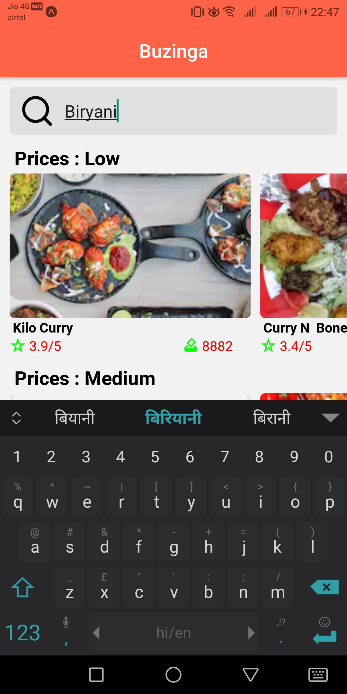
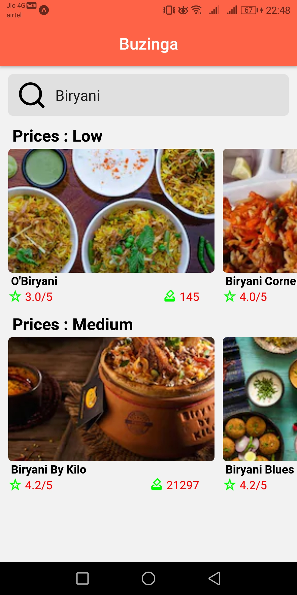
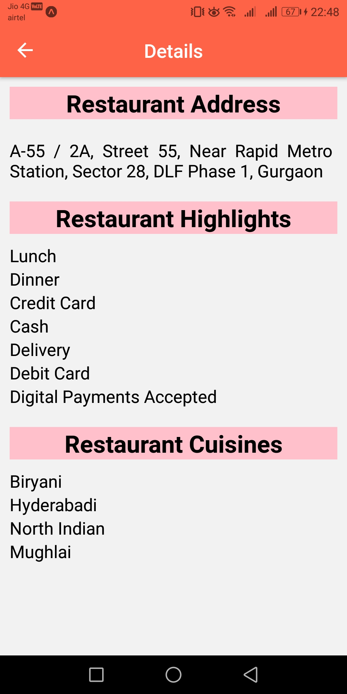

# Buzinga Food Search App :pizza:
> <li> This app uses Zomato's API to fetch query results.</li>
> <li> API documentation link: https://developers.zomato.com/documentation </li>

## App Features :package:

<table align = "center">
  <tr border-spacing= 10px>
    <td>
 :bowtie: Search for restaurants by name, cuisine, or location. 
</td>
    <td>
 :sunglasses:  Display detailed information including ratings. 
</td>
    <td>
 :man: Get restaurant highlights, address, and cuisine. 
</td>
  </tr>
  <tr>
    <td></td>
    <td></td>
    <td></td>
  </tr>
</table>

## How To Run The App On Your Mobile :question:
> <li> Download the expo client from https://play.google.com/store/apps/details?id=host.exp.exponent&hl=en_IN </li> 
> <li> Using the expo client app, scan the QR code from https://expo.io/@ayushporwal/buzinga-food-search-app </li> 
> That's it, You are done.

#### Please feel free to message suggestions or better create a pull request. Thank You :exclamation:  :smiley:
